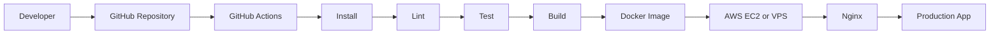

<!--
  GitHub Profile README for Saiful Islam
  Designed to match the clean premium layout shown in the reference screenshots.
  Replace project link placeholders with your actual repository and live-demo URLs.
-->

<div align="center">


<br />


</div>

---

## 👋 About Me

```yaml
name: Saiful Islam
role: Full Stack Developer
location: Dhaka, Bangladesh

education:
  degree: B.Sc. in Computer Science & Engineering
  cgpa: 3.67 / 4.00

current_company: SparkTech Agency (Betopia)

experience:
  - 8+ production-grade full-stack applications
  - 250+ RESTful APIs
  - E-commerce, SaaS, ride-sharing, real estate, and marketplace systems
  - Authentication, payments, analytics, notifications, and real-time features

currently_focused_on:
  - Scalable Node.js and Express.js backends
  - Next.js and TypeScript applications
  - Redis and RabbitMQ workflows
  - Dockerized development and CI/CD automation

mindset: Build secure, scalable, maintainable software
```

I’m a **Full Stack Developer** focused on building production-grade web applications, scalable backend systems, and reliable business workflows.  
My recent work includes e-commerce, SaaS, ride-sharing, real estate, booking, and marketplace platforms using **Node.js, Express.js, Next.js, React, TypeScript, MongoDB, Redis, RabbitMQ, AWS S3, Socket.IO, JWT, Stripe, and Stripe Connect**.

---

## 🚀 Current Focus

<table>
<tr>
<td width="50%" valign="top">

### ⚡ Full Stack Engineering

Building scalable applications with **Next.js, React, Node.js, Express.js, TypeScript, MongoDB, JWT, RBAC, and Stripe**.

</td>
<td width="50%" valign="top">

### 🔌 Backend API Development

Designing secure REST APIs for authentication, payments, inventory, bookings, analytics, notifications, and admin workflows.

</td>
</tr>

<tr>
<td width="50%" valign="top">

### 🐳 Docker & CI/CD

Containerizing applications with **Docker** and automating testing, builds, and deployment through **GitHub Actions**.

</td>
<td width="50%" valign="top">

### ☁️ Cloud & Real-Time Systems

Working with **AWS S3, AWS EC2, Socket.IO, Redis, RabbitMQ, Nginx, and Linux-based deployments**.

</td>
</tr>
</table>

---

## 🛠 Tech Stack

### Frontend

<p>
  
  &nbsp;&nbsp;
  
  &nbsp;&nbsp;
  
  &nbsp;&nbsp;
  
  &nbsp;&nbsp;
  
  &nbsp;&nbsp;
  
  &nbsp;&nbsp;
  
</p>

### Backend & Database

<p>
  
  &nbsp;&nbsp;
  
  &nbsp;&nbsp;
  
  &nbsp;&nbsp;
  
  &nbsp;&nbsp;
  
  &nbsp;&nbsp;
  
</p>

### Cloud & DevOps

<p>
  
  &nbsp;&nbsp;
  
  &nbsp;&nbsp;
  
  &nbsp;&nbsp;
  
  &nbsp;&nbsp;
  
</p>

### Tools & Platforms

<p>
  
  &nbsp;&nbsp;
  
  &nbsp;&nbsp;
  
  &nbsp;&nbsp;
  
  &nbsp;&nbsp;
  
</p>

### Services & Integrations

<p>
  
  
  
  
</p>

---

## 🌟 Featured Projects

<table>
<tr>
<td width="50%" valign="top">

### 💇 Salon Management SaaS Dashboard

A scalable management dashboard with 10+ business modules, 20+ responsive pages, and 40+ reusable components.

**Features:**
- KPI cards, charts, tables, and filters
- Leaflet-based location analytics
- Responsive navigation and nested sidebars
- Role-based workflows
- Backend-integration-ready architecture

**Tech:** Next.js, React, TypeScript, Tailwind CSS, Shadcn UI, Recharts, Leaflet

[Repository](https://github.com/SaifulET/Salon_Owner_Dashboard_SaaS) • [Live Demo](https://sass-owner-dashboard.vercel.app/)

</td>

<td width="50%" valign="top">

### 🛒 Smokenza E-commerce Platform

A full-stack commerce platform with customer, admin, and backend systems.

**Features:**
- 100+ frontend and dashboard modules
- 19+ REST APIs
- 20+ controllers
- 23+ services
- 17 database models
- Checkout, inventory, payments, and refunds
- AWS S3 storage and Socket.IO notifications

**Tech:** Node.js, Express.js, MongoDB, Next.js, React, TypeScript, AWS S3, Socket.IO

[Frontend](https://github.com/SaifulET/Smokenza-Frontend) • [Backend](https://github.com/SaifulET/Smokenza-Backend) • [Live Demo](https://smokenza.com/)

</td>
</tr>

<tr>
<td width="50%" valign="top">

### 🚗 Uber Ride-Sharing Platform

A scalable ride-sharing backend with 100+ RESTful APIs.

**Features:**
- Authentication and driver onboarding
- Ride booking and trip management
- Stripe and Stripe Connect payments
- Real-time ride requests and trip updates
- Rider-driver communication
- AWS S3 document management

**Tech:** Node.js, Express.js, MongoDB, Socket.IO, Stripe, AWS S3, Next.js, TypeScript

[Backend Repository](https://github.com/SaifulET/Uber_Backend)

</td>

<td width="50%" valign="top">

### 👑 Wardrop / Style-Sync

A fashion platform backend for outfit planning, community interaction, notifications, and administration.

**Features:**
- 20+ backend APIs
- Authentication and outfit management
- Planner and community workflows
- Scheduled reminders
- Notifications and analytics
- Improved API reliability by 30%+

**Tech:** Node.js, Express.js, MongoDB, AWS S3, JWT

[Backend Repository](https://github.com/SaifulET/Wardrop)

</td>
</tr>

<tr>
<td width="50%" valign="top">

### 🏢 Real Estate Management Platform

A centralized system for managing property projects, floors, units, employees, and administrative workflows.

**Features:**
- JWT authentication and password recovery
- Role-based permissions
- Multilingual support
- Company profile management
- AWS S3 uploads
- Export-ready dashboards

**Tech:** Next.js, React, Express.js, MongoDB, JWT, AWS S3

[Frontend](https://github.com/SaifulET/RealEstate_Frontend) • [Backend](https://github.com/SaifulET/RealEstate_Backend)

</td>

<td width="50%" valign="top">

### 📅 Bookly Service Marketplace

A service marketplace and booking platform with location-based discovery and role-based dashboards.

**Features:**
- Real-time availability
- Booking workflows
- Owner, staff, supervisor, and admin dashboards
- Schedule and payout management
- Interactive maps
- Performance analytics

**Tech:** Next.js, React, TypeScript, Tailwind CSS, Mapbox, Geoapify

[Frontend Repository](https://github.com/SaifulET/Bookly_Local_Sass_application) • [Live Demo](https://booklycy.vercel.app/)

</td>
</tr>
</table>

---

## ♾️ CI/CD & Deployment



- Dockerized application environments
- Docker Compose for local multi-service development
- GitHub Actions for automated validation and deployment
- Secure environment variables through GitHub Secrets
- AWS EC2 or VPS deployment
- Nginx reverse proxy configuration

---

## 🐍 Contribution Snake

<div align="center">

<svg viewBox="-16 -32 880 192" width="880" height="192" xmlns="http://www.w3.org/2000/svg"><desc>Generated with https://github.com/Platane/snk</desc><style>:root{--cb:#1b1f230a;--cs:purple;--ce:#161b22;--c0:#161b22;--c1:#01311f;--c2:#034525;--c3:#0f6d31;--c4:#00c647}.c{shape-rendering:geometricPrecision;fill:var(--ce);stroke-width:1px;stroke:var(--cb);animation:none 46900ms linear infinite;width:12px;height:12px}@keyframes c0{1.48%{fill:var(--c1)}1.5%,100%{fill:var(--ce)}}.c.c0{fill:var(--c1);animation-name:c0}@keyframes c1{0.84%{fill:var(--c1)}0.86%,100%{fill:var(--ce)}}.c.c1{fill:var(--c1);animation-name:c1}@keyframes c2{1.27%{fill:var(--c1)}1.29%,100%{fill:var(--ce)}}.c.c2{fill:var(--c1);animation-name:c2}@keyframes c3{75.26%{fill:var(--c2)}75.28%,100%{fill:var(--ce)}}.c.c3{fill:var(--c2);animation-name:c3}@keyframes c4{2.55%{fill:var(--c1)}2.57%,100%{fill:var(--ce)}}.c.c4{fill:var(--c1);animation-name:c4}@keyframes c5{7.45%{fill:var(--c1)}7.47%,100%{fill:var(--ce)}}.c.c5{fill:var(--c1);animation-name:c5}@keyframes c6{3.19%{fill:var(--c1)}3.21%,100%{fill:var(--ce)}}.c.c6{fill:var(--c1);animation-name:c6}@keyframes c7{8.95%{fill:var(--c1)}8.97%,100%{fill:var(--ce)}}.c.c7{fill:var(--c1);animation-name:c7}@keyframes c8{7.03%{fill:var(--c1)}7.05%,100%{fill:var(--ce)}}.c.c8{fill:var(--c1);animation-name:c8}@keyframes c9{3.83%{fill:var(--c1)}3.85%,100%{fill:var(--ce)}}.c.c9{fill:var(--c1);animation-name:c9}@keyframes ca{6.81%{fill:var(--c1)}6.83%,100%{fill:var(--ce)}}.c.ca{fill:var(--c1);animation-name:ca}@keyframes cb{6.6%{fill:var(--c1)}6.62%,100%{fill:var(--ce)}}.c.cb{fill:var(--c1);animation-name:cb}@keyframes cc{6.39%{fill:var(--c1)}6.41%,100%{fill:var(--ce)}}.c.cc{fill:var(--c1);animation-name:cc}@keyframes cd{5.96%{fill:var(--c1)}5.98%,100%{fill:var(--ce)}}.c.cd{fill:var(--c1);animation-name:cd}@keyframes ce{4.25%{fill:var(--c1)}4.27%,100%{fill:var(--ce)}}.c.ce{fill:var(--c1);animation-name:ce}@keyframes cf{4.47%{fill:var(--c1)}4.49%,100%{fill:var(--ce)}}.c.cf{fill:var(--c1);animation-name:cf}@keyframes cg{5.53%{fill:var(--c1)}5.55%,100%{fill:var(--ce)}}.c.cg{fill:var(--c1);animation-name:cg}@keyframes ch{5.11%{fill:var(--c1)}5.13%,100%{fill:var(--ce)}}.c.ch{fill:var(--c1);animation-name:ch}@keyframes ci{11.72%{fill:var(--c1)}11.74%,100%{fill:var(--ce)}}.c.ci{fill:var(--c1);animation-name:ci}@keyframes cj{11.29%{fill:var(--c1)}11.31%,100%{fill:var(--ce)}}.c.cj{fill:var(--c1);animation-name:cj}@keyframes ck{10.86%{fill:var(--c1)}10.88%,100%{fill:var(--ce)}}.c.ck{fill:var(--c1);animation-name:ck}@keyframes cl{12.36%{fill:var(--c1)}12.38%,100%{fill:var(--ce)}}.c.cl{fill:var(--c1);animation-name:cl}@keyframes cm{13.85%{fill:var(--c1)}13.87%,100%{fill:var(--ce)}}.c.cm{fill:var(--c1);animation-name:cm}@keyframes cn{47.75%{fill:var(--c1)}47.77%,100%{fill:var(--ce)}}.c.cn{fill:var(--c1);animation-name:cn}@keyframes co{14.06%{fill:var(--c1)}14.08%,100%{fill:var(--ce)}}.c.co{fill:var(--c1);animation-name:co}@keyframes cp{70.57%{fill:var(--c2)}70.59%,100%{fill:var(--ce)}}.c.cp{fill:var(--c2);animation-name:cp}@keyframes cq{46.05%{fill:var(--c1)}46.07%,100%{fill:var(--ce)}}.c.cq{fill:var(--c1);animation-name:cq}@keyframes cr{45.83%{fill:var(--c1)}45.85%,100%{fill:var(--ce)}}.c.cr{fill:var(--c1);animation-name:cr}@keyframes cs{46.47%{fill:var(--c1)}46.49%,100%{fill:var(--ce)}}.c.cs{fill:var(--c1);animation-name:cs}@keyframes ct{69.71%{fill:var(--c2)}69.73%,100%{fill:var(--ce)}}.c.ct{fill:var(--c2);animation-name:ct}@keyframes cu{45.62%{fill:var(--c1)}45.64%,100%{fill:var(--ce)}}.c.cu{fill:var(--c1);animation-name:cu}@keyframes cv{46.69%{fill:var(--c1)}46.71%,100%{fill:var(--ce)}}.c.cv{fill:var(--c1);animation-name:cv}@keyframes cw{47.11%{fill:var(--c1)}47.13%,100%{fill:var(--ce)}}.c.cw{fill:var(--c1);animation-name:cw}@keyframes cx{14.7%{fill:var(--c1)}14.72%,100%{fill:var(--ce)}}.c.cx{fill:var(--c1);animation-name:cx}@keyframes cy{69.07%{fill:var(--c2)}69.09%,100%{fill:var(--ce)}}.c.cy{fill:var(--c2);animation-name:cy}@keyframes cz{45.41%{fill:var(--c1)}45.43%,100%{fill:var(--ce)}}.c.cz{fill:var(--c1);animation-name:cz}@keyframes c10{53.08%{fill:var(--c1)}53.1%,100%{fill:var(--ce)}}.c.c10{fill:var(--c1);animation-name:c10}@keyframes c11{45.19%{fill:var(--c1)}45.21%,100%{fill:var(--ce)}}.c.c11{fill:var(--c1);animation-name:c11}@keyframes c12{44.98%{fill:var(--c1)}45%,100%{fill:var(--ce)}}.c.c12{fill:var(--c1);animation-name:c12}@keyframes c13{67.79%{fill:var(--c2)}67.81%,100%{fill:var(--ce)}}.c.c13{fill:var(--c2);animation-name:c13}@keyframes c14{68.01%{fill:var(--c2)}68.03%,100%{fill:var(--ce)}}.c.c14{fill:var(--c2);animation-name:c14}@keyframes c15{15.13%{fill:var(--c1)}15.15%,100%{fill:var(--ce)}}.c.c15{fill:var(--c1);animation-name:c15}@keyframes c16{15.77%{fill:var(--c1)}15.79%,100%{fill:var(--ce)}}.c.c16{fill:var(--c1);animation-name:c16}@keyframes c17{15.98%{fill:var(--c1)}16%,100%{fill:var(--ce)}}.c.c17{fill:var(--c1);animation-name:c17}@keyframes c18{44.77%{fill:var(--c1)}44.79%,100%{fill:var(--ce)}}.c.c18{fill:var(--c1);animation-name:c18}@keyframes c19{49.67%{fill:var(--c1)}49.69%,100%{fill:var(--ce)}}.c.c19{fill:var(--c1);animation-name:c19}@keyframes c1a{15.34%{fill:var(--c1)}15.36%,100%{fill:var(--ce)}}.c.c1a{fill:var(--c1);animation-name:c1a}@keyframes c1b{16.19%{fill:var(--c1)}16.21%,100%{fill:var(--ce)}}.c.c1b{fill:var(--c1);animation-name:c1b}@keyframes c1c{44.55%{fill:var(--c1)}44.57%,100%{fill:var(--ce)}}.c.c1c{fill:var(--c1);animation-name:c1c}@keyframes c1d{50.1%{fill:var(--c1)}50.12%,100%{fill:var(--ce)}}.c.c1d{fill:var(--c1);animation-name:c1d}@keyframes c1e{16.41%{fill:var(--c1)}16.43%,100%{fill:var(--ce)}}.c.c1e{fill:var(--c1);animation-name:c1e}@keyframes c1f{16.62%{fill:var(--c1)}16.64%,100%{fill:var(--ce)}}.c.c1f{fill:var(--c1);animation-name:c1f}@keyframes c1g{44.13%{fill:var(--c1)}44.15%,100%{fill:var(--ce)}}.c.c1g{fill:var(--c1);animation-name:c1g}@keyframes c1h{43.91%{fill:var(--c1)}43.93%,100%{fill:var(--ce)}}.c.c1h{fill:var(--c1);animation-name:c1h}@keyframes c1i{51.8%{fill:var(--c1)}51.82%,100%{fill:var(--ce)}}.c.c1i{fill:var(--c1);animation-name:c1i}@keyframes c1j{16.83%{fill:var(--c1)}16.85%,100%{fill:var(--ce)}}.c.c1j{fill:var(--c1);animation-name:c1j}@keyframes c1k{51.59%{fill:var(--c1)}51.61%,100%{fill:var(--ce)}}.c.c1k{fill:var(--c1);animation-name:c1k}@keyframes c1l{51.38%{fill:var(--c1)}51.4%,100%{fill:var(--ce)}}.c.c1l{fill:var(--c1);animation-name:c1l}@keyframes c1m{17.05%{fill:var(--c1)}17.07%,100%{fill:var(--ce)}}.c.c1m{fill:var(--c1);animation-name:c1m}@keyframes c1n{43.27%{fill:var(--c1)}43.29%,100%{fill:var(--ce)}}.c.c1n{fill:var(--c1);animation-name:c1n}@keyframes c1o{43.49%{fill:var(--c1)}43.51%,100%{fill:var(--ce)}}.c.c1o{fill:var(--c1);animation-name:c1o}@keyframes c1p{21.53%{fill:var(--c1)}21.55%,100%{fill:var(--ce)}}.c.c1p{fill:var(--c1);animation-name:c1p}@keyframes c1q{21.74%{fill:var(--c1)}21.76%,100%{fill:var(--ce)}}.c.c1q{fill:var(--c1);animation-name:c1q}@keyframes c1r{17.69%{fill:var(--c1)}17.71%,100%{fill:var(--ce)}}.c.c1r{fill:var(--c1);animation-name:c1r}@keyframes c1s{17.47%{fill:var(--c1)}17.49%,100%{fill:var(--ce)}}.c.c1s{fill:var(--c1);animation-name:c1s}@keyframes c1t{17.26%{fill:var(--c1)}17.28%,100%{fill:var(--ce)}}.c.c1t{fill:var(--c1);animation-name:c1t}@keyframes c1u{43.06%{fill:var(--c1)}43.08%,100%{fill:var(--ce)}}.c.c1u{fill:var(--c1);animation-name:c1u}@keyframes c1v{21.31%{fill:var(--c1)}21.33%,100%{fill:var(--ce)}}.c.c1v{fill:var(--c1);animation-name:c1v}@keyframes c1w{21.95%{fill:var(--c1)}21.97%,100%{fill:var(--ce)}}.c.c1w{fill:var(--c1);animation-name:c1w}@keyframes c1x{17.9%{fill:var(--c1)}17.92%,100%{fill:var(--ce)}}.c.c1x{fill:var(--c1);animation-name:c1x}@keyframes c1y{21.1%{fill:var(--c1)}21.12%,100%{fill:var(--ce)}}.c.c1y{fill:var(--c1);animation-name:c1y}@keyframes c1z{22.16%{fill:var(--c1)}22.18%,100%{fill:var(--ce)}}.c.c1z{fill:var(--c1);animation-name:c1z}@keyframes c20{18.11%{fill:var(--c1)}18.13%,100%{fill:var(--ce)}}.c.c20{fill:var(--c1);animation-name:c20}@keyframes c21{41.35%{fill:var(--c1)}41.37%,100%{fill:var(--ce)}}.c.c21{fill:var(--c1);animation-name:c21}@keyframes c22{41.57%{fill:var(--c1)}41.59%,100%{fill:var(--ce)}}.c.c22{fill:var(--c1);animation-name:c22}@keyframes c23{42.42%{fill:var(--c1)}42.44%,100%{fill:var(--ce)}}.c.c23{fill:var(--c1);animation-name:c23}@keyframes c24{20.89%{fill:var(--c1)}20.91%,100%{fill:var(--ce)}}.c.c24{fill:var(--c1);animation-name:c24}@keyframes c25{22.38%{fill:var(--c1)}22.4%,100%{fill:var(--ce)}}.c.c25{fill:var(--c1);animation-name:c25}@keyframes c26{18.33%{fill:var(--c1)}18.35%,100%{fill:var(--ce)}}.c.c26{fill:var(--c1);animation-name:c26}@keyframes c27{41.14%{fill:var(--c1)}41.16%,100%{fill:var(--ce)}}.c.c27{fill:var(--c1);animation-name:c27}@keyframes c28{41.78%{fill:var(--c1)}41.8%,100%{fill:var(--ce)}}.c.c28{fill:var(--c1);animation-name:c28}@keyframes c29{41.99%{fill:var(--c1)}42.01%,100%{fill:var(--ce)}}.c.c29{fill:var(--c1);animation-name:c29}@keyframes c2a{42.21%{fill:var(--c1)}42.23%,100%{fill:var(--ce)}}.c.c2a{fill:var(--c1);animation-name:c2a}@keyframes c2b{20.67%{fill:var(--c1)}20.69%,100%{fill:var(--ce)}}.c.c2b{fill:var(--c1);animation-name:c2b}@keyframes c2c{22.59%{fill:var(--c1)}22.61%,100%{fill:var(--ce)}}.c.c2c{fill:var(--c1);animation-name:c2c}@keyframes c2d{18.54%{fill:var(--c1)}18.56%,100%{fill:var(--ce)}}.c.c2d{fill:var(--c1);animation-name:c2d}@keyframes c2e{40.93%{fill:var(--c1)}40.95%,100%{fill:var(--ce)}}.c.c2e{fill:var(--c1);animation-name:c2e}@keyframes c2f{40.71%{fill:var(--c1)}40.73%,100%{fill:var(--ce)}}.c.c2f{fill:var(--c1);animation-name:c2f}@keyframes c2g{84.85%{fill:var(--c4)}84.87%,100%{fill:var(--ce)}}.c.c2g{fill:var(--c4);animation-name:c2g}@keyframes c2h{22.8%{fill:var(--c1)}22.82%,100%{fill:var(--ce)}}.c.c2h{fill:var(--c1);animation-name:c2h}@keyframes c2i{18.75%{fill:var(--c1)}18.77%,100%{fill:var(--ce)}}.c.c2i{fill:var(--c1);animation-name:c2i}@keyframes c2j{23.23%{fill:var(--c1)}23.25%,100%{fill:var(--ce)}}.c.c2j{fill:var(--c1);animation-name:c2j}@keyframes c2k{40.5%{fill:var(--c1)}40.52%,100%{fill:var(--ce)}}.c.c2k{fill:var(--c1);animation-name:c2k}@keyframes c2l{19.82%{fill:var(--c1)}19.84%,100%{fill:var(--ce)}}.c.c2l{fill:var(--c1);animation-name:c2l}@keyframes c2m{83.15%{fill:var(--c3)}83.17%,100%{fill:var(--ce)}}.c.c2m{fill:var(--c3);animation-name:c2m}@keyframes c2n{18.97%{fill:var(--c1)}18.99%,100%{fill:var(--ce)}}.c.c2n{fill:var(--c1);animation-name:c2n}@keyframes c2o{56.71%{fill:var(--c1)}56.73%,100%{fill:var(--ce)}}.c.c2o{fill:var(--c1);animation-name:c2o}@keyframes c2p{56.92%{fill:var(--c1)}56.94%,100%{fill:var(--ce)}}.c.c2p{fill:var(--c1);animation-name:c2p}@keyframes c2q{19.61%{fill:var(--c1)}19.63%,100%{fill:var(--ce)}}.c.c2q{fill:var(--c1);animation-name:c2q}@keyframes c2r{19.18%{fill:var(--c1)}19.2%,100%{fill:var(--ce)}}.c.c2r{fill:var(--c1);animation-name:c2r}@keyframes c2s{23.66%{fill:var(--c1)}23.68%,100%{fill:var(--ce)}}.c.c2s{fill:var(--c1);animation-name:c2s}@keyframes c2t{57.13%{fill:var(--c1)}57.15%,100%{fill:var(--ce)}}.c.c2t{fill:var(--c1);animation-name:c2t}@keyframes c2u{59.9%{fill:var(--c2)}59.92%,100%{fill:var(--ce)}}.c.c2u{fill:var(--c2);animation-name:c2u}@keyframes c2v{83.57%{fill:var(--c3)}83.59%,100%{fill:var(--ce)}}.c.c2v{fill:var(--c3);animation-name:c2v}@keyframes c2w{83.79%{fill:var(--c4)}83.81%,100%{fill:var(--ce)}}.c.c2w{fill:var(--c4);animation-name:c2w}@keyframes c2x{29.84%{fill:var(--c1)}29.86%,100%{fill:var(--ce)}}.c.c2x{fill:var(--c1);animation-name:c2x}@keyframes c2y{30.05%{fill:var(--c1)}30.07%,100%{fill:var(--ce)}}.c.c2y{fill:var(--c1);animation-name:c2y}@keyframes c2z{27.71%{fill:var(--c1)}27.73%,100%{fill:var(--ce)}}.c.c2z{fill:var(--c1);animation-name:c2z}@keyframes c30{27.92%{fill:var(--c1)}27.94%,100%{fill:var(--ce)}}.c.c30{fill:var(--c1);animation-name:c30}@keyframes c31{28.99%{fill:var(--c1)}29.01%,100%{fill:var(--ce)}}.c.c31{fill:var(--c1);animation-name:c31}@keyframes c32{24.08%{fill:var(--c1)}24.1%,100%{fill:var(--ce)}}.c.c32{fill:var(--c1);animation-name:c32}@keyframes c33{29.41%{fill:var(--c1)}29.43%,100%{fill:var(--ce)}}.c.c33{fill:var(--c1);animation-name:c33}@keyframes c34{30.27%{fill:var(--c1)}30.29%,100%{fill:var(--ce)}}.c.c34{fill:var(--c1);animation-name:c34}@keyframes c35{27.5%{fill:var(--c1)}27.52%,100%{fill:var(--ce)}}.c.c35{fill:var(--c1);animation-name:c35}@keyframes c36{28.13%{fill:var(--c1)}28.15%,100%{fill:var(--ce)}}.c.c36{fill:var(--c1);animation-name:c36}@keyframes c37{58.63%{fill:var(--c2)}58.65%,100%{fill:var(--ce)}}.c.c37{fill:var(--c2);animation-name:c37}@keyframes c38{24.3%{fill:var(--c1)}24.32%,100%{fill:var(--ce)}}.c.c38{fill:var(--c1);animation-name:c38}@keyframes c39{59.05%{fill:var(--c2)}59.07%,100%{fill:var(--ce)}}.c.c39{fill:var(--c2);animation-name:c39}@keyframes c3a{58.84%{fill:var(--c2)}58.86%,100%{fill:var(--ce)}}.c.c3a{fill:var(--c2);animation-name:c3a}@keyframes c3b{31.55%{fill:var(--c1)}31.57%,100%{fill:var(--ce)}}.c.c3b{fill:var(--c1);animation-name:c3b}@keyframes c3c{30.91%{fill:var(--c1)}30.93%,100%{fill:var(--ce)}}.c.c3c{fill:var(--c1);animation-name:c3c}@keyframes c3d{30.69%{fill:var(--c1)}30.71%,100%{fill:var(--ce)}}.c.c3d{fill:var(--c1);animation-name:c3d}@keyframes c3e{27.07%{fill:var(--c1)}27.09%,100%{fill:var(--ce)}}.c.c3e{fill:var(--c1);animation-name:c3e}@keyframes c3f{24.72%{fill:var(--c1)}24.74%,100%{fill:var(--ce)}}.c.c3f{fill:var(--c1);animation-name:c3f}@keyframes c3g{31.33%{fill:var(--c1)}31.35%,100%{fill:var(--ce)}}.c.c3g{fill:var(--c1);animation-name:c3g}@keyframes c3h{31.12%{fill:var(--c1)}31.14%,100%{fill:var(--ce)}}.c.c3h{fill:var(--c1);animation-name:c3h}@keyframes c3i{88.48%{fill:var(--c4)}88.5%,100%{fill:var(--ce)}}.c.c3i{fill:var(--c4);animation-name:c3i}@keyframes c3j{86.98%{fill:var(--c4)}87%,100%{fill:var(--ce)}}.c.c3j{fill:var(--c4);animation-name:c3j}@keyframes c3k{26.64%{fill:var(--c1)}26.66%,100%{fill:var(--ce)}}.c.c3k{fill:var(--c1);animation-name:c3k}@keyframes c3l{32.4%{fill:var(--c1)}32.42%,100%{fill:var(--ce)}}.c.c3l{fill:var(--c1);animation-name:c3l}@keyframes c3m{24.94%{fill:var(--c1)}24.96%,100%{fill:var(--ce)}}.c.c3m{fill:var(--c1);animation-name:c3m}@keyframes c3n{26.43%{fill:var(--c1)}26.45%,100%{fill:var(--ce)}}.c.c3n{fill:var(--c1);animation-name:c3n}@keyframes c3o{25.36%{fill:var(--c1)}25.38%,100%{fill:var(--ce)}}.c.c3o{fill:var(--c1);animation-name:c3o}@keyframes c3p{25.15%{fill:var(--c1)}25.17%,100%{fill:var(--ce)}}.c.c3p{fill:var(--c1);animation-name:c3p}@keyframes c3q{62.89%{fill:var(--c2)}62.91%,100%{fill:var(--ce)}}.c.c3q{fill:var(--c2);animation-name:c3q}@keyframes c3r{33.25%{fill:var(--c1)}33.27%,100%{fill:var(--ce)}}.c.c3r{fill:var(--c1);animation-name:c3r}@keyframes c3s{63.32%{fill:var(--c2)}63.34%,100%{fill:var(--ce)}}.c.c3s{fill:var(--c2);animation-name:c3s}@keyframes c3t{61.82%{fill:var(--c2)}61.84%,100%{fill:var(--ce)}}.c.c3t{fill:var(--c2);animation-name:c3t}@keyframes c3u{25.58%{fill:var(--c1)}25.6%,100%{fill:var(--ce)}}.c.c3u{fill:var(--c1);animation-name:c3u}@keyframes c3v{62.46%{fill:var(--c2)}62.48%,100%{fill:var(--ce)}}.c.c3v{fill:var(--c2);animation-name:c3v}@keyframes c3w{35.38%{fill:var(--c1)}35.4%,100%{fill:var(--ce)}}.c.c3w{fill:var(--c1);animation-name:c3w}@keyframes c3x{34.96%{fill:var(--c1)}34.98%,100%{fill:var(--ce)}}.c.c3x{fill:var(--c1);animation-name:c3x}@keyframes c3y{26%{fill:var(--c1)}26.02%,100%{fill:var(--ce)}}.c.c3y{fill:var(--c1);animation-name:c3y}@keyframes c3z{25.79%{fill:var(--c1)}25.81%,100%{fill:var(--ce)}}.c.c3z{fill:var(--c1);animation-name:c3z}@keyframes c40{33.89%{fill:var(--c1)}33.91%,100%{fill:var(--ce)}}.c.c40{fill:var(--c1);animation-name:c40}@keyframes c41{33.68%{fill:var(--c1)}33.7%,100%{fill:var(--ce)}}.c.c41{fill:var(--c1);animation-name:c41}@keyframes c42{34.74%{fill:var(--c1)}34.76%,100%{fill:var(--ce)}}.c.c42{fill:var(--c1);animation-name:c42}@keyframes c43{34.11%{fill:var(--c1)}34.13%,100%{fill:var(--ce)}}.c.c43{fill:var(--c1);animation-name:c43}@keyframes c44{34.53%{fill:var(--c1)}34.55%,100%{fill:var(--ce)}}.c.c44{fill:var(--c1);animation-name:c44}@keyframes c45{36.88%{fill:var(--c1)}36.9%,100%{fill:var(--ce)}}.c.c45{fill:var(--c1);animation-name:c45}<g class="u u0"><rect class="c" x="2" y="66" rx="2" ry="2"/><rect class="c" x="18" y="34" rx="2" ry="2"/><rect class="c" x="18" y="66" rx="2" ry="2"/><rect class="c" x="66" y="50" rx="2" ry="2"/><rect class="c" x="98" y="2" rx="2" ry="2"/><rect class="c" x="98" y="66" rx="2" ry="2"/><rect class="c" x="114" y="98" rx="2" ry="2"/><rect class="c" x="130" y="2" rx="2" ry="2"/><rect class="c" x="130" y="82" rx="2" ry="2"/><rect class="c" x="146" y="2" rx="2" ry="2"/><rect class="c" x="146" y="18" rx="2" ry="2"/><rect class="c" x="146" y="34" rx="2" ry="2"/><rect class="c" x="162" y="50" rx="2" ry="2"/><rect class="c" x="162" y="82" rx="2" ry="2"/><rect class="c" x="256" y="32" rx="2" ry="2"/><rect class="c" x="256" y="96" rx="2" ry="2"/><rect class="c" x="272" y="32" rx="2" ry="2"/><rect class="c" x="272" y="96" rx="2" ry="2"/><rect class="c" x="368" y="16" rx="2" ry="2"/><rect class="c" x="368" y="96" rx="2" ry="2"/><rect class="c" x="384" y="48" rx="2" ry="2"/><rect class="c" x="384" y="64" rx="2" ry="2"/><rect class="c" x="416" y="64" rx="2" ry="2"/><rect class="c" x="416" y="96" rx="2" ry="2"/><rect class="c" x="432" y="64" rx="2" ry="2"/><rect class="c" x="432" y="80" rx="2" ry="2"/><rect class="c" x="448" y="0" rx="2" ry="2"/><rect class="c" x="448" y="16" rx="2" ry="2"/><rect class="c" x="448" y="48" rx="2" ry="2"/><rect class="c" x="448" y="64" rx="2" ry="2"/><rect class="c" x="464" y="32" rx="2" ry="2"/><rect class="c" x="464" y="48" rx="2" ry="2"/><rect class="c" x="464" y="64" rx="2" ry="2"/><rect class="c" x="464" y="80" rx="2" ry="2"/><rect class="c" x="480" y="16" rx="2" ry="2"/><rect class="c" x="480" y="32" rx="2" ry="2"/><rect class="c" x="480" y="80" rx="2" ry="2"/><rect class="c" x="480" y="96" rx="2" ry="2"/><rect class="c" x="496" y="48" rx="2" ry="2"/><rect class="c" x="496" y="64" rx="2" ry="2"/><rect class="c" x="496" y="80" rx="2" ry="2"/><rect class="c" x="496" y="96" rx="2" ry="2"/><rect class="c" x="512" y="32" rx="2" ry="2"/><rect class="c" x="528" y="32" rx="2" ry="2"/><rect class="c" x="528" y="80" rx="2" ry="2"/><rect class="c" x="528" y="96" rx="2" ry="2"/><rect class="c" x="544" y="0" rx="2" ry="2"/><rect class="c" x="544" y="16" rx="2" ry="2"/><rect class="c" x="544" y="32" rx="2" ry="2"/><rect class="c" x="544" y="64" rx="2" ry="2"/><rect class="c" x="576" y="48" rx="2" ry="2"/><rect class="c" x="576" y="64" rx="2" ry="2"/><rect class="c" x="576" y="80" rx="2" ry="2"/><rect class="c" x="576" y="96" rx="2" ry="2"/><rect class="c" x="592" y="64" rx="2" ry="2"/><rect class="c" x="592" y="96" rx="2" ry="2"/><rect class="c" x="608" y="0" rx="2" ry="2"/><rect class="c" x="608" y="64" rx="2" ry="2"/><rect class="c" x="624" y="16" rx="2" ry="2"/><rect class="c" x="624" y="48" rx="2" ry="2"/><rect class="c" x="640" y="0" rx="2" ry="2"/><rect class="c" x="640" y="32" rx="2" ry="2"/><rect class="c" x="640" y="48" rx="2" ry="2"/><rect class="c" x="640" y="64" rx="2" ry="2"/><rect class="c" x="640" y="96" rx="2" ry="2"/><rect class="c" x="656" y="0" rx="2" ry="2"/><rect class="c" x="656" y="32" rx="2" ry="2"/><rect class="c" x="688" y="0" rx="2" ry="2"/><rect class="c" x="688" y="16" rx="2" ry="2"/><rect class="c" x="688" y="64" rx="2" ry="2"/><rect class="c" x="704" y="0" rx="2" ry="2"/><rect class="c" x="704" y="16" rx="2" ry="2"/><rect class="c" x="720" y="48" rx="2" ry="2"/><rect class="c" x="720" y="64" rx="2" ry="2"/><rect class="c" x="720" y="80" rx="2" ry="2"/><rect class="c" x="720" y="96" rx="2" ry="2"/><rect class="c" x="736" y="16" rx="2" ry="2"/><rect class="c" x="736" y="32" rx="2" ry="2"/><rect class="c" x="736" y="48" rx="2" ry="2"/><rect class="c" x="736" y="64" rx="2" ry="2"/><rect class="c" x="736" y="80" rx="2" ry="2"/><rect class="c" x="752" y="32" rx="2" ry="2"/><rect class="c" x="752" y="80" rx="2" ry="2"/><rect class="c" x="784" y="64" rx="2" ry="2"/><rect class="c" x="784" y="96" rx="2" ry="2"/><rect class="c" x="800" y="0" rx="2" ry="2"/><rect class="c" x="800" y="16" rx="2" ry="2"/><rect class="c" x="800" y="32" rx="2" ry="2"/><rect class="c" x="800" y="64" rx="2" ry="2"/><rect class="c" x="800" y="80" rx="2" ry="2"/><rect class="c" x="816" y="64" rx="2" ry="2"/><rect class="c" x="816" y="96" rx="2" ry="2"/><rect class="c" x="832" y="0" rx="2" ry="2"/><rect class="c" x="832" y="64" rx="2" ry="2"/></g><g class="u u1"><rect class="c" x="384" y="0" rx="2" ry="2"/><rect class="c" x="432" y="0" rx="2" ry="2"/><rect class="c" x="432" y="96" rx="2" ry="2"/><rect class="c" x="528" y="96" rx="2" ry="2"/><rect class="c" x="588" y="-16" rx="2" ry="2" width="28" height="28"/><rect class="c" x="592" y="0" rx="2" ry="2"/><rect class="c" x="624" y="16" rx="2" ry="2"/><rect class="c" x="624" y="32" rx="2" ry="2"/><rect class="c" x="672" y="0" rx="2" ry="2"/><rect class="c" x="704" y="16" rx="2" ry="2"/><rect class="c" x="752" y="80" rx="2" ry="2"/><rect class="c" x="768" y="48" rx="2" ry="2"/><rect class="c" x="768" y="96" rx="2" ry="2"/><rect class="c" x="800" y="16" rx="2" ry="2"/></g><g class="u u2"><rect class="c" x="814" y="16" rx="2" ry="2" width="28" height="28"/><rect class="c" x="816" y="32" rx="2" ry="2"/></g><g class="u u3"><rect class="c" x="825" y="48" rx="2" ry="2" width="28" height="28"/><rect class="c" x="832" y="64" rx="2" ry="2"/><rect class="c" x="832" y="80" rx="2" ry="2"/><rect class="c" x="832" y="96" rx="2" ry="2"/></g><g class="s s0"><circle cx="6" cy="6" r="5"/><path d="M 6 1 L 6 5 M 6 11 L 6 7 M 1 6 L 5 6 M 11 6 L 7 6" stroke-width="1px"/></g><g class="s s1"><circle cx="6" cy="6" r="5"/><path d="M 6 1 L 6 5 M 6 11 L 6 7 M 1 6 L 5 6 M 11 6 L 7 6" stroke-width="1px"/></g><g class="s s2"><circle cx="6" cy="6" r="5"/><path d="M 6 1 L 6 5 M 6 11 L 6 7 M 1 6 L 5 6 M 11 6 L 7 6" stroke-width="1px"/></g><g class="s s3"><circle cx="6" cy="6" r="5"/><path d="M 6 1 L 6 5 M 6 11 L 6 7 M 1 6 L 5 6 M 11 6 L 7 6" stroke-width="1px"/></g></svg>

</div>

---

## 🎯 What I Bring

```txt
Full Stack Development     ██████████████████░░░   90%
Backend API Development    ███████████████████░░   92%
Node.js / Express.js       ██████████████████░░░   90%
MongoDB / Mongoose         █████████████████░░░░   88%
React / Next.js            █████████████████░░░░   88%
Docker & CI/CD             ███████████████░░░░░░   78%
Cloud Integrations         ████████████████░░░░░   80%
Problem Solving            █████████████████░░░░   85%
```

---

## 📬 Connect With Me

<div align="center">

<a href="mailto:saifulislam3412883@gmail.com">
  
</a>
<a href="https://www.linkedin.com/in/saiful-islam-834467317/">
  
</a>
<a href="https://saiful-portfolio-three.vercel.app/">
  
</a>
<a href="https://github.com/SaifulET">
  
</a>

<br />
<br />

### ⚡ Building secure, scalable, and production-ready applications.


</div>
