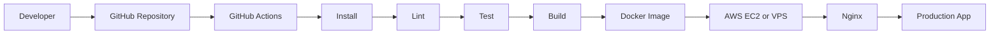

<!--
  GitHub Profile README for Saiful Islam
  Designed to match the clean premium layout shown in the reference screenshots.
  Replace project link placeholders with your actual repository and live-demo URLs.
-->

<div align="center">


<br />


</div>

---

## 👋 About Me

```yaml
name: Saiful Islam
role: Full Stack Developer
location: Dhaka, Bangladesh

education:
  degree: B.Sc. in Computer Science & Engineering
  cgpa: 3.67 / 4.00

current_company: SparkTech Agency (Betopia)

experience:
  - 8+ production-grade full-stack applications
  - 250+ RESTful APIs
  - E-commerce, SaaS, ride-sharing, real estate, and marketplace systems
  - Authentication, payments, analytics, notifications, and real-time features

currently_focused_on:
  - Scalable Node.js and Express.js backends
  - Next.js and TypeScript applications
  - Redis and RabbitMQ workflows
  - Dockerized development and CI/CD automation

mindset: Build secure, scalable, maintainable software
```

I’m a **Full Stack Developer** focused on building production-grade web applications, scalable backend systems, and reliable business workflows.  
My recent work includes e-commerce, SaaS, ride-sharing, real estate, booking, and marketplace platforms using **Node.js, Express.js, Next.js, React, TypeScript, MongoDB, Redis, RabbitMQ, AWS S3, Socket.IO, JWT, Stripe, and Stripe Connect**.

---

## 🚀 Current Focus

<table>
<tr>
<td width="50%" valign="top">

### ⚡ Full Stack Engineering

Building scalable applications with **Next.js, React, Node.js, Express.js, TypeScript, MongoDB, JWT, RBAC, and Stripe**.

</td>
<td width="50%" valign="top">

### 🔌 Backend API Development

Designing secure REST APIs for authentication, payments, inventory, bookings, analytics, notifications, and admin workflows.

</td>
</tr>

<tr>
<td width="50%" valign="top">

### 🐳 Docker & CI/CD

Containerizing applications with **Docker** and automating testing, builds, and deployment through **GitHub Actions**.

</td>
<td width="50%" valign="top">

### ☁️ Cloud & Real-Time Systems

Working with **AWS S3, AWS EC2, Socket.IO, Redis, RabbitMQ, Nginx, and Linux-based deployments**.

</td>
</tr>
</table>

---

## 🛠 Tech Stack

### Frontend

<p>
  
  &nbsp;&nbsp;
  
  &nbsp;&nbsp;
  
  &nbsp;&nbsp;
  
  &nbsp;&nbsp;
  
  &nbsp;&nbsp;
  
  &nbsp;&nbsp;
  
</p>

### Backend & Database

<p>
  
  &nbsp;&nbsp;
  
  &nbsp;&nbsp;
  
  &nbsp;&nbsp;
  
  &nbsp;&nbsp;
  
  &nbsp;&nbsp;
  
</p>

### Cloud & DevOps

<p>
  
  &nbsp;&nbsp;
  
  &nbsp;&nbsp;
  
  &nbsp;&nbsp;
  
  &nbsp;&nbsp;
  
</p>

### Tools & Platforms

<p>
  
  &nbsp;&nbsp;
  
  &nbsp;&nbsp;
  
  &nbsp;&nbsp;
  
  &nbsp;&nbsp;
  
</p>

### Services & Integrations

<p>
  
  
  
  
</p>

---

## 🌟 Featured Projects

<table>
<tr>
<td width="50%" valign="top">

### 💇 Salon Management SaaS Dashboard

A scalable management dashboard with 10+ business modules, 20+ responsive pages, and 40+ reusable components.

**Features:**
- KPI cards, charts, tables, and filters
- Leaflet-based location analytics
- Responsive navigation and nested sidebars
- Role-based workflows
- Backend-integration-ready architecture

**Tech:** Next.js, React, TypeScript, Tailwind CSS, Shadcn UI, Recharts, Leaflet

[Repository](https://github.com/SaifulET/Salon_Owner_Dashboard_SaaS) • [Live Demo](https://sass-owner-dashboard.vercel.app/)

</td>

<td width="50%" valign="top">

### 🛒 Smokenza E-commerce Platform

A full-stack commerce platform with customer, admin, and backend systems.

**Features:**
- 100+ frontend and dashboard modules
- 19+ REST APIs
- 20+ controllers
- 23+ services
- 17 database models
- Checkout, inventory, payments, and refunds
- AWS S3 storage and Socket.IO notifications

**Tech:** Node.js, Express.js, MongoDB, Next.js, React, TypeScript, AWS S3, Socket.IO

[Frontend](https://github.com/SaifulET/Smokenza-Frontend) • [Backend](https://github.com/SaifulET/Smokenza-Backend) • [Live Demo](https://smokenza.com/)

</td>
</tr>

<tr>
<td width="50%" valign="top">

### 🚗 Uber Ride-Sharing Platform

A scalable ride-sharing backend with 100+ RESTful APIs.

**Features:**
- Authentication and driver onboarding
- Ride booking and trip management
- Stripe and Stripe Connect payments
- Real-time ride requests and trip updates
- Rider-driver communication
- AWS S3 document management

**Tech:** Node.js, Express.js, MongoDB, Socket.IO, Stripe, AWS S3, Next.js, TypeScript

[Backend Repository](https://github.com/SaifulET/Uber_Backend)

</td>

<td width="50%" valign="top">

### 👑 Wardrop / Style-Sync

A fashion platform backend for outfit planning, community interaction, notifications, and administration.

**Features:**
- 20+ backend APIs
- Authentication and outfit management
- Planner and community workflows
- Scheduled reminders
- Notifications and analytics
- Improved API reliability by 30%+

**Tech:** Node.js, Express.js, MongoDB, AWS S3, JWT

[Backend Repository](https://github.com/SaifulET/Wardrop)

</td>
</tr>

<tr>
<td width="50%" valign="top">

### 🏢 Real Estate Management Platform

A centralized system for managing property projects, floors, units, employees, and administrative workflows.

**Features:**
- JWT authentication and password recovery
- Role-based permissions
- Multilingual support
- Company profile management
- AWS S3 uploads
- Export-ready dashboards

**Tech:** Next.js, React, Express.js, MongoDB, JWT, AWS S3

[Frontend](https://github.com/SaifulET/RealEstate_Frontend) • [Backend](https://github.com/SaifulET/RealEstate_Backend)

</td>

<td width="50%" valign="top">

### 📅 Bookly Service Marketplace

A service marketplace and booking platform with location-based discovery and role-based dashboards.

**Features:**
- Real-time availability
- Booking workflows
- Owner, staff, supervisor, and admin dashboards
- Schedule and payout management
- Interactive maps
- Performance analytics

**Tech:** Next.js, React, TypeScript, Tailwind CSS, Mapbox, Geoapify

[Frontend Repository](https://github.com/SaifulET/Bookly_Local_Sass_application) • [Live Demo](https://booklycy.vercel.app/)

</td>
</tr>
</table>

---

## ♾️ CI/CD & Deployment



- Dockerized application environments
- Docker Compose for local multi-service development
- GitHub Actions for automated validation and deployment
- Secure environment variables through GitHub Secrets
- AWS EC2 or VPS deployment
- Nginx reverse proxy configuration
---

## 🐍 Contribution Snake

<div align="center">

<picture>
  <source media="(prefers-color-scheme: dark)" srcset="https://raw.githubusercontent.com/SaifulET/SaifulET/output/github-contribution-grid-snake-dark.svg" />
  <source media="(prefers-color-scheme: light)" srcset="https://raw.githubusercontent.com/SaifulET/SaifulET/output/github-contribution-grid-snake.svg" />
  
</picture>

</div>

---

## 🎯 What I Bring

```txt
Full Stack Development     ██████████████████░░░   90%
Backend API Development    ███████████████████░░   92%
Node.js / Express.js       ██████████████████░░░   90%
MongoDB / Mongoose         █████████████████░░░░   88%
React / Next.js            █████████████████░░░░   88%
Docker & CI/CD             ███████████████░░░░░░   78%
Cloud Integrations         ████████████████░░░░░   80%
Problem Solving            █████████████████░░░░   85%
```

---

## 📬 Connect With Me

<div align="center">

<a href="mailto:saifulislam3412883@gmail.com">
  
</a>
<a href="https://www.linkedin.com/in/saiful-islam-834467317/">
  
</a>
<a href="https://saiful-portfolio-three.vercel.app/">
  
</a>
<a href="https://github.com/SaifulET">
  
</a>

<br />
<br />

### ⚡ Building secure, scalable, and production-ready applications.


</div>
